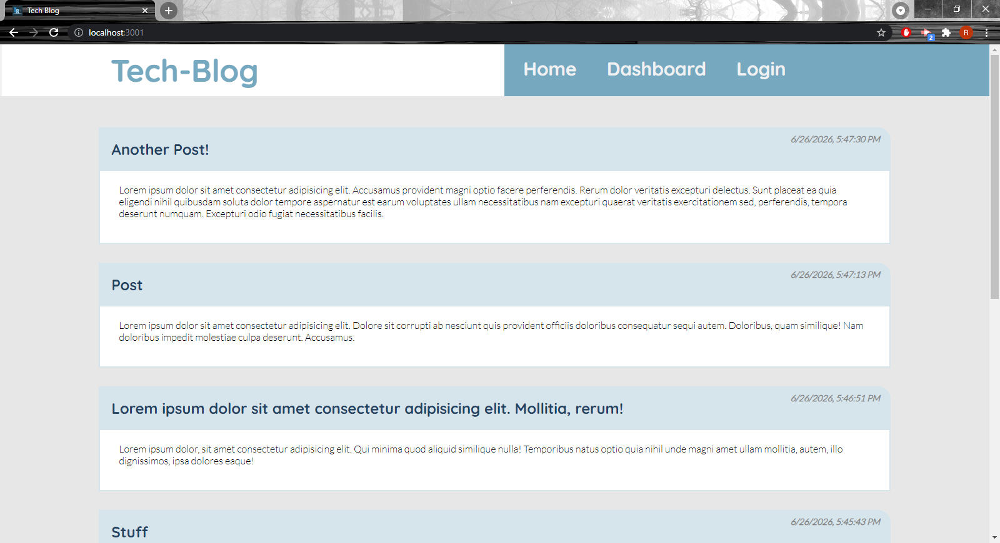
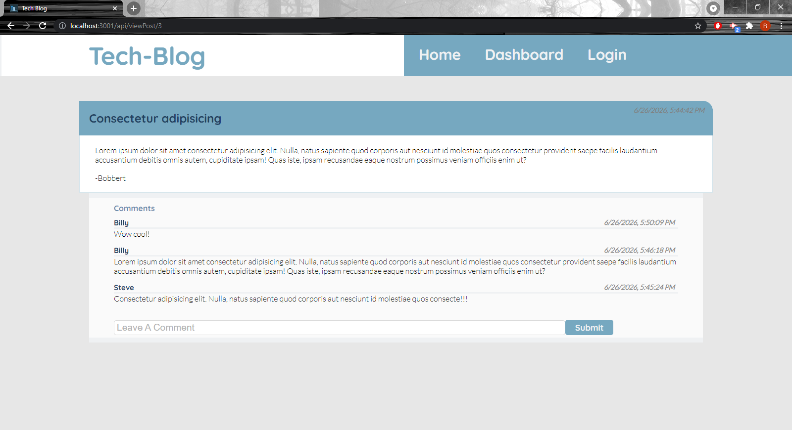
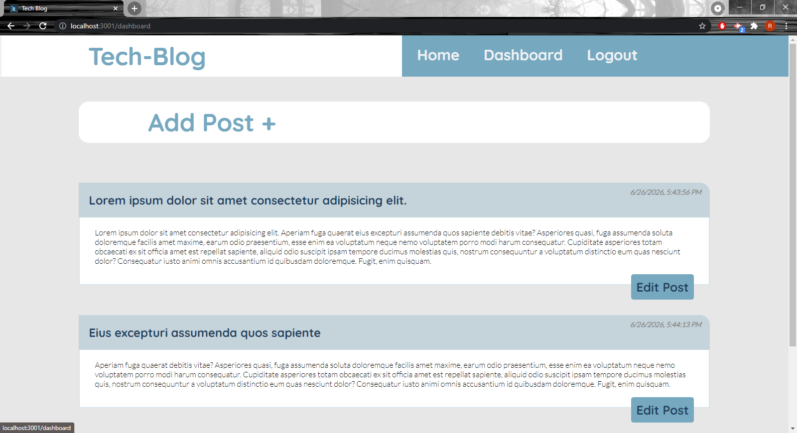
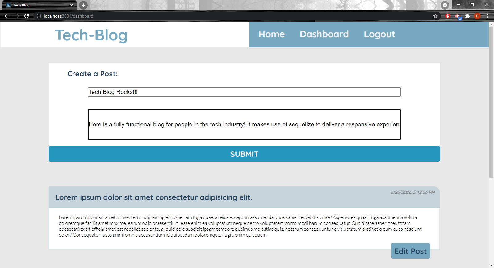
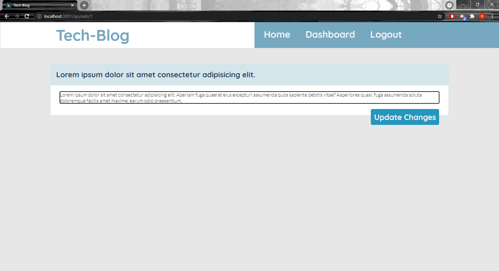
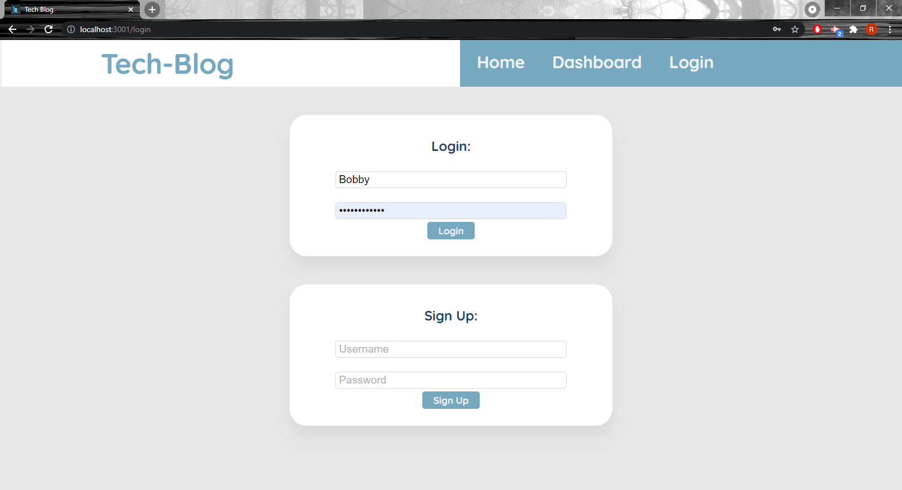

 # Tech-Blog
## Description
Here is a fully functional blog for people in the tech industry! It makes use of sequelize to deliver a responsive experience to each unique user. A user is able to create, edit and delete posts while also being able to comment on other users posts. 
## Table of Contents

[Usage](#usage)

[Screenshots](#screenshots)

[License](#license)

[Contribute](#contribute)

[Tests](#tests)

[Questions](#questions)

## Usage
To use this application, just sign in, then go to the dashboard to create a new post!

## Screenshots

## License
This project is licensed under the MIT license.
## Contribute
Anyone is free to contribute however they like
## Tests

## Questions
 If you have any questions please visit my GitHub at https://github.com/robert-rousset or email me at robertrousset94@gmail.com.